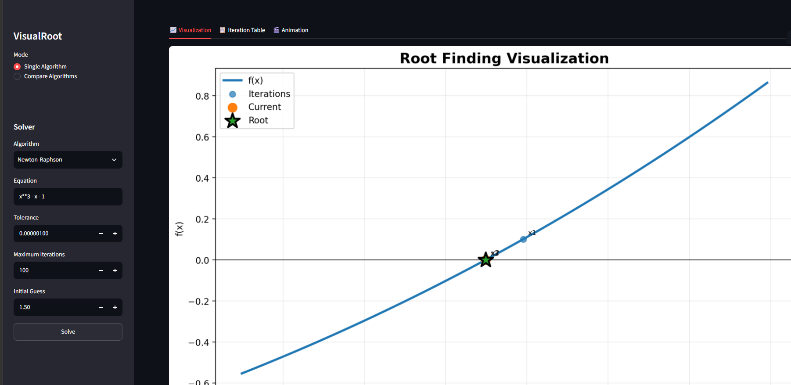
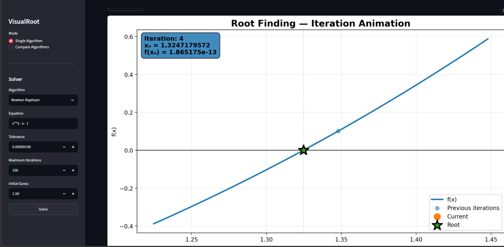
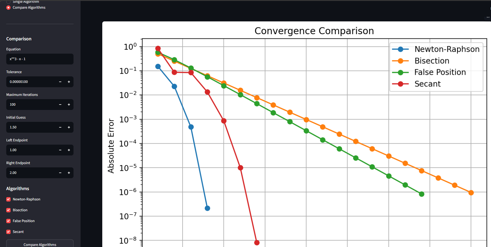

# VisualRoot

### Interactive Numerical Root Finding Toolkit

VisualRoot is an interactive web application for visualizing and comparing numerical root-finding algorithms. It helps students understand **how numerical methods converge**, rather than only displaying the final answer.

---

## Features

- Solve nonlinear equations interactively
- Supports **5 numerical methods**
- Step-by-step iteration table
- Function visualization
- Iteration animation
- Compare multiple algorithms
- Convergence analysis
- Adjustable tolerance and iteration limits

---

## Screenshots

### Root Finding Visualization



### Iteration Animation



### Algorithm Comparison



---

## Supported Algorithms

| Method | Type |
|---------|------|
| Bisection | Bracketing |
| False Position | Bracketing |
| Newton-Raphson | Open Method |
| Secant | Open Method |
| Fixed Point Iteration | Iterative Method |

---

## Tech Stack

- Python
- Streamlit
- NumPy
- SymPy
- Matplotlib

---

## Project Structure

```text
VisualRoot/
│
├── algorithms/
│   ├── bisection.py
│   ├── false_position.py
│   ├── fixed_point.py
│   ├── newton.py
│   ├── registry.py
│   └── secant.py
│
├── utils/
│   ├── animation.py
│   ├── comparison.py
│   ├── convergence.py
│   ├── helpers.py
│   ├── parser.py
│   └── plotting.py
│
├── app.py
├── README.md
└── requirements.txt
```

---

## Installation

```bash
git clone https://github.com/Shahnas-parveen/VisualRoot.git
cd VisualRoot

python -m venv venv
venv\Scripts\activate

pip install -r requirements.txt
streamlit run app.py
```

---

## Example

**Equation**

```text
x**3 - x - 1
```

**Interval**

```text
[1, 2]
```

VisualRoot compares how different numerical methods converge to the same root.

---

## Future Improvements

- More numerical methods
- Better animation controls
- Export iteration reports
- Interactive zoom and graph tools

---

## Author

**Shahnas Parveen**

B.Tech. Information Science & Engineering